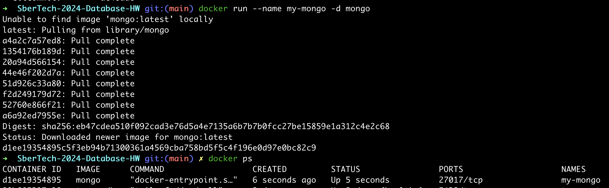
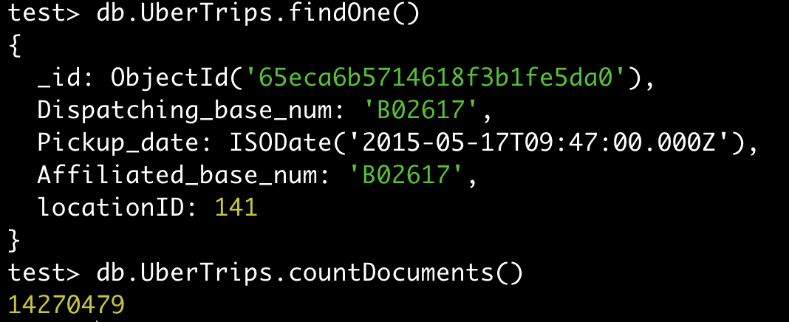
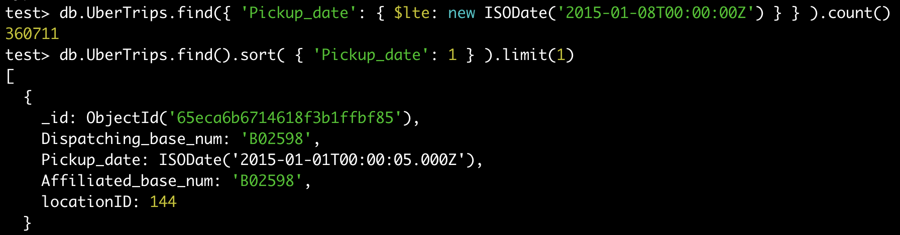
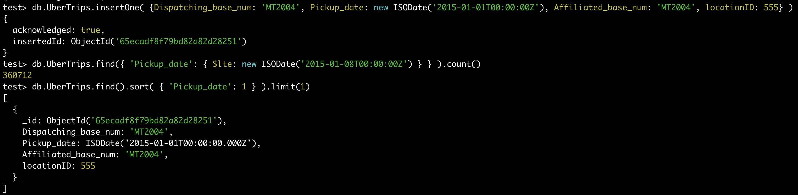
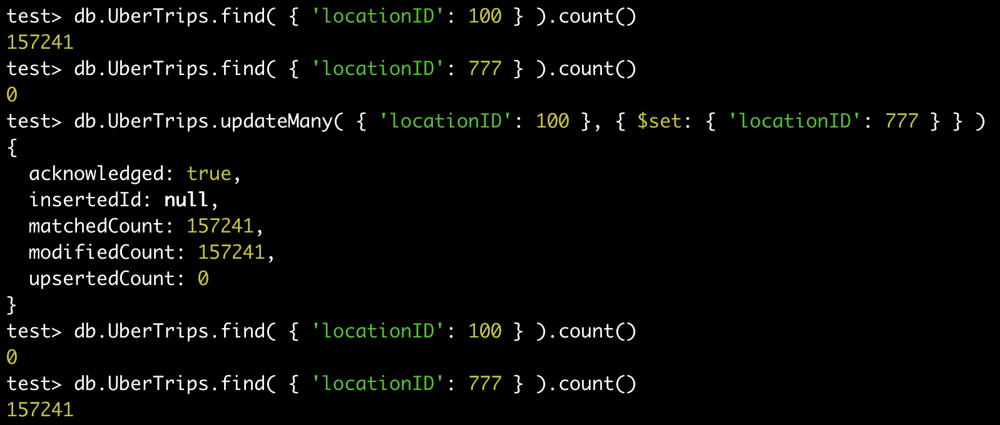
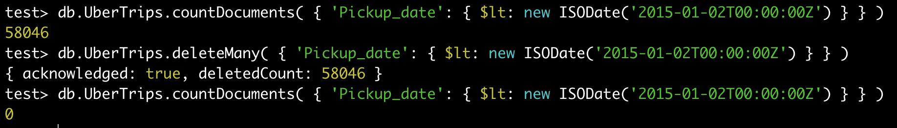
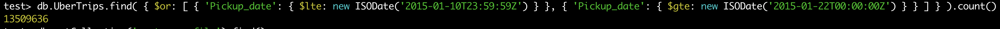

# Работа с MongoDB

1. Разворачивать бд будем в докере:

```
-> docker version

Client:
 Cloud integration: v1.0.35+desktop.10
 Version:           25.0.2
 API version:       1.44
 Go version:        go1.21.6
 Git commit:        29cf629
 Built:             Thu Feb  1 00:18:45 2024
 OS/Arch:           darwin/arm64
 Context:           desktop-linux

Server: Docker Desktop 4.27.1 (136059)
 Engine:
  Version:          25.0.2
  API version:      1.44 (minimum version 1.24)
  Go version:       go1.21.6
  Git commit:       fce6e0c
  Built:            Thu Feb  1 00:23:21 2024
  OS/Arch:          linux/arm64
  Experimental:     false
 containerd:
  Version:          1.6.28
  GitCommit:        ae07eda36dd25f8a1b98dfbf587313b99c0190bb
 runc:
  Version:          1.1.12
  GitCommit:        v1.1.12-0-g51d5e94
 docker-init:
  Version:          0.19.0
  GitCommit:        de40ad0
```



2. Используем консоль монго внутри контейнера:


3. Скачаем [датасет](https://www.kaggle.com/datasets/fivethirtyeight/uber-pickups-in-new-york-city) о поездках в Uber  в Нью-Йорке за январь 2015.
Получим документы такого вида, в таком количестве:



4. (R) Посмотрим, сколько поездок было в первую неделю 2015 года и когда была первая:



5. (C) Вставим новую поездку ровно в Новый Год, предыдущие результаты при этом должны измениться:



6. (U) 100 - слишком пафосный id для локации, заменим его на 777:



7. (D) Удалим все поездки 1-го января:



8. (Index) Создадим индекс над полем `Pickup_date` и выполним следующий запрос:



При помощи встроенного [профилировщика](https://www.mongodb.com/docs/manual/tutorial/manage-the-database-profiler/#database-profiler) получим, что
время выполнения запроса без индекса составляет `3887ms`, с индексом - `3020ms`, что более чем на 20% быстрее