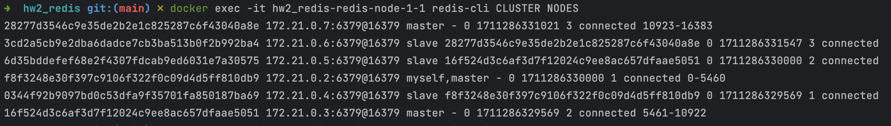

# Работа с Redis

1. Разворачиваем Redis с помощью докера:

```yaml
version: '3.3'

services:
  redis:
    image: redis
    ports:
      - "6379:6379"
```

2. Проверяем доступность:


Далее работать будем с помощью Python:

```python
import redis

r = redis.Redis(host='localhost', port=6379, db=1)
```

3. Скачаем json файл, содержащий 1000000 записей такого вида:

```python
{
    'id': 0, 
    'name': 'Mateo', 
    'city': 'Nashville', 
    'age': 96, 
    'friends': [
        {'name': 'Isabella', 'hobbies': ['Bicycling', 'Team Sports']}, 
        {'name': 'Jack', 'hobbies': ['Housework', 'Bicycling']}
                ]
}
```

Работать будем со всеми полями, кроме `friends`

4. Вставим данные с помощью `SET`:

```python
%%time

pipe = r.pipeline()
for user in users_data:
    for field in ('name', 'city', 'age'):
        pipe.set(f'users:{user["id"]}:{field}', user[field])

pipe.execute()
```

Время вставки ~ `24 s`. Теперь попробуем получить данные:

```python
%%time

r.get('key_612')
```

Время получения ~ `6.6 ms`

4. Вставим данные с помощью `HSET`:

```python
%%time

pipe = r.pipeline()
for user in users_data:
    for field in ('name', 'city', 'age'):
        pipe.hset(f'users:{user["id"]}', field, user[field])

pipe.execute()
```

Время вставки ~ `24 s`. Теперь попробуем получить данные:

```python
%%time

r.hget('users:41279', 'name')
```

Время получения ~ `4.5 ms`, чуть быстрее предыдущего способа

5. Используем Redis Sorted Sets для хранения возраста пользователей:

```python
%%time

r.zadd('users_age', {user['id']: user['age'] for user in users_data})
```

Время вставки ~ `3.46 s`. Найдем id пользователей с наименьшим возрастом:

```python
%%time

r.zrange('users_age', 0, 2)

Out: [b'100194', b'100270', b'100364']
```

Время работы ~ `25.5 ms`

6. Вставим имена пользователей в Redis List:

```python
%%time

for user in users_data:
    r.lpush('users_name', user['name'])
```

Время вставки ~ `23.1 s`. Выберем первых 6 пользователей в листе:

```python
%%time

r.lrange('users_name', 0, 5)

Out: [b'Zoey', b'Emily', b'Sarah', b'Leo', b'Charlotte', b'Chris']
```

Время работы ~ `30.7 ms`

7. Поднимаем кластер на 6 нодах (3 мастера + 3 реплики) с помощью [docker-compose](hw2_redis/docker-compose.yaml).
[Конфиг](hw2_redis/redis.conf) для нод (здесь можно подкрутить таймауты):

```
port 6379
cluster-enabled yes
cluster-config-file nodes.conf
cluster-node-timeout 5000
appendonly yes
```


8. Выведем список нод:



9. Проверим, что они связаны. Запишем данные на одной ноде и прочитаем на другой:


10. Проверим отказоустойчивость. Положим мастера, реплика должна его заменить:


Действительно, нода на хосте `172.21.0.4` стала мастером.