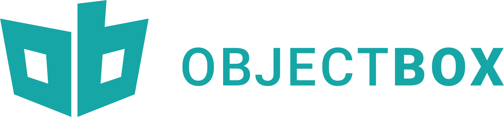
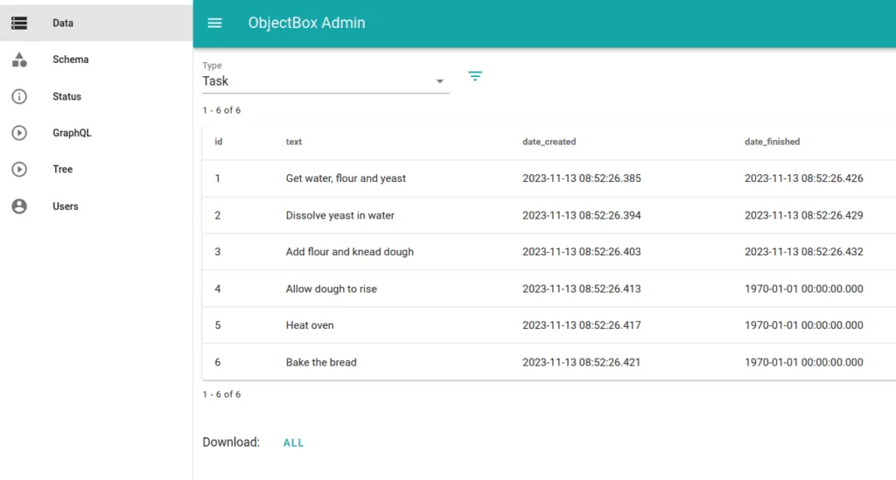

# [ObjectBox](https://objectbox.io) - объектно-ориентированная база данных

## 1. История развития 
 


**ObjectBox** был запущен как стартап компанией **ObjectBox Ltd.**, основанной в Мюнхене, Германия, в 2015 году. Создтели Вивиен Доллинджер (Vivien Dollinger) и Маркус Юнгингер (Markus Junginger) стремились создать базу данных, которая была бы идеально адаптирована к потребностям мобильных и IoT-разработчиков.

## 2. Инструменты для взаимодействия 



**ObjectBox** предоставляет API для языков программирования, таких как Java, Kotlin, Swift, и C++.
Также предоставляется веб-инструмент **ObjectBox Data Browser** для удобного просмотра и управления данными без необходимости написания дополнительного кода.

Преимущества использования **ObjectBox** с помощью этих инструментов:

- **Высокая производительность и малый размер**: Особенно важно для мобильных и встраиваемых систем.
- **Удобный API и минимальное количество кода**: Упрощает работу разработчиков и поддерживает чистоту кода.
- **Поддержка реактивных программных паттернов**: Упрощает реализацию динамически обновляемых пользовательских интерфейсов.
- **Многоплатформенность**: Поддерживает разные языки программирования и платформы, что делает его гибким решением для различных типов проектов.

## 3. Database Engine 

**ObjectBox** использует собственную разработку базы данных, которая была специально создана для обеспечения высокой производительности на мобильных устройствах и IoT. **ObjectBox Storage Engine**, так называется этот движок, оптимизирован для быстрой работы с объектами, минимизации задержек и эффективного использования ресурсов.

Основные особенности **ObjectBox Storage Engine**:
- **Object-oriented**: Работает напрямую с объектами, что упрощает интеграцию с объектно-ориентированными языками программирования и уменьшает необходимость в ORM (Object-Relational Mapping).
- **Indexing**: Предоставляет высокооптимизированные индексы для быстрых запросов, которые специально разработаны для мобильных устройств и IoT.
- **ACID Transactions**: Поддерживает транзакции, соответствующие требованиям ACID, обеспечивая надежность и целостность данных.
- **Low Latency**: Проектировался с прицелом на минимальные задержки, что критично для приложений, требующих быстрого отклика.
- **Data Synchronization**: Встроенная поддержка синхронизации данных между устройствами и серверами, что удобно для создания сложных распределенных систем.


## 4. Язык запросов

1. **Object Query Language (OQL)**: **ObjectBox** использует собственный **Object Query Language**, который разработан специально для удобства работы с объектами и их свойствами. Этот язык запросов удовлетворяет потребностям объектно-ориентированных программистов, облегчая запросы к данным на основе их классов и атрибутов.

2. **QueryBuilder**: Для построения запросов в **ObjectBox** используется конструктор запросов (**QueryBuilder**), который позволяет создавать запросы к базе данных с помощью удобного и интуитивно понятного программного интерфейса. Это позволяет программистам формулировать сложные запросы без написания прямого SQL кода.

Повторим [Get Started](https://golang.objectbox.io/getting-started) с помощью языка Go. Для этого объявим модели и сгенерируем исходники для работы с бд:


- [/model/model.go](hw4_objectbox/model/model.go)
```
package model

//go:generate go run github.com/objectbox/objectbox-go/cmd/objectbox-gogen

type Task struct {
	Id           uint64
	Title        string `objectbox:"index:hash64"`
	Text         string
	DateCreated  int64
	DateFinished int64
}

```

А вот так можно выполнить стандартные CRUD запросы: 

- [/main.go](hw4_objectbox/main.go)
```
func main() {
   // load objectbox
   ob := initObjectBox()
   defer ob.Close() // In a server app, you would just keep ob and close on shutdown
   
   box := model.BoxForTask(ob)
   
   // Create
   id, _ := box.Put(&model.Task{
      Text: "Buy milk",
   })
   
   task, _ := box.Get(id) // Read
   task.Text += " & some bread"
   box.Put(task)         // Update
   box.Remove(task)      // Delete
}
```

## 5. Распределение данных по разным носителям

**ObjectBox** предназначен для использования в сценариях с высокой производительностью для мобильных и IoT-устройств, где часто используется единый физический носитель для хранения данных. Поэтому **ObjectBox** не предоставляет встроенных инструментов для распределения данных по разным дискам или носителям.

## 6. Язык программирования

**ObjectBox** разработана в основном с использованием языка программирования **C++**, который известен своей высокой производительностью и эффективностью использования ресурсов, а также кроссплатформенностью.

## 7. Индексы

**ObjectBox**, как современная, высокопроизводительная база данных, предоставляет поддержку индексации для ускорения запросов на чтение. Ниже приведены основные типы индексов, которые поддерживаются в **ObjectBox**:

### **Value-based Indexes** (Основанные на значениях)
Это самый базовый и распространённый тип индексов, который позволяет быстро находить данные на основе значения определённого поля или атрибута объекта. Например, если у вас есть класс Person с полями name и age, вы можете создать индекс по полю name для ускорения поиска по этому полю.

### **Unique Indexes** (Уникальные индексы)
Уникальные индексы гарантируют, что в определённом поле не будет дублирующихся значений. Это полезно, например, для уникальных идентификаторов пользователей или любых других данных, которые должны быть уникальными в пределах таблицы.

### **Composite Indexes** (Композитные индексы)
Композитные индексы включают в себя несколько полей объекта. Они могут быть полезны, если вы часто выполняете запросы, которые фильтруются по множеству атрибутов. Например, индекс мог бы быть построен на полях firstName и lastName.


Создать индекс, работаю с Go, можно при помощи тегов структур, как это сделано в примере выше:

```
Title        string `objectbox:"index:hash64"`
```

## 8. Процесс выполнения запросов

### 1. Определение Запроса
Процесс начинается с определения запроса с использованием **QueryBuilder** в **ObjectBox**

### 2. Получение Списка Данных
После построения запроса, разработчик может выполнить запрос, который возвращает списки объектов, соответствующих критериям запроса. Запросы могут быть выполнены синхронно или асинхронно, в зависимости от потребностей приложения.

### 3. Обработка Индексов
**ObjectBox** использует оптимизированные индексы для повышения эффективности запросов. Если поля, используемые в запросе, проиндексированы, база данных может быстро найти соответствующие записи без необходимости полного сканирования всех данных. Это критически важно для производительности, особенно на устройствах с ограниченными ресурсами.

### 4. Оптимизация и Выполнение
При выполнении запроса **ObjectBox** оптимизирует процесс обработки данных, используя внутренние механизмы кэширования и эффективное управление памятью для минимизации загрузки I/O и использования CPU. Запросы выполняются с учётом текущего состояния индексов и кэша данных, что позволяет достигать максимальной производительности.

### 5. Возврат Результатов
Конечные результаты запроса возвращаются в виде коллекций объектов, которые можно непосредственно использовать в приложении. Эти объекты уже готовы к использованию, что ускоряет процесс разработки и повышает надёжность кода.


## 9. Планы запросов
**ObjectBox** не предоставляет публично функцию прямого взаимодействия с "планами запросов"

## 10. Транзакции

**ObjectBox** поддерживает транзакции, вот ключевые аспекты их использования:

### 1. ACID Свойства
**ObjectBox** следует принципам ACID, что гарантирует, что транзакции являются атомарными, консистентными, изолированными и устойчивыми


### 2. Использование Транзакций
Транзакции в ObjectBox могут быть как чтения, так и записи:

- Транзакции записи (Write Transactions): Используются для создания, обновления или удаления данных. Транзакции записи блокируются, чтобы гарантировать, что несколько потоков или операций не могут одновременно изменять данные.
- Транзакции чтения (Read Transactions): Предоставляют согласованное представление данных на момент начала транзакции. Обычно они не вызывают блокировок данных и позволяют обеспечить высокую производительность при чтении.

### 3. Примеры Кода
Пример использования транзакции записи на GO:

```
ob.RunInWriteTx(func() error {
	for i := 1000000; i > 0; i-- {
		box.Put(&iot.Event{})
	}
	return nil // return no error so the transaction is not rolled back
})
```


## 10. Восстановление данных

**ObjectBox** предлагает различные механизмы для обеспечения устойчивости и восстановления данных. Ниже перечислены некоторые общие стратегии и функции восстановления, которые поддерживает **ObjectBox**:

### 1. Автоматическая Долговечность (Durability)
**ObjectBox** гарантирует долговечность данных в соответствии с ACID-свойствами. Это означает, что после завершения транзакции все изменения данных надёжно сохраняются на устройстве. Это базовое свойство долговечности помогает защитить данные даже при внезапных сбоях системы или приложения.

### 2. Транзакционный Журнал (Transaction Log)
Для управления транзакциями и восстановления после сбоев **ObjectBox** использует транзакционные журналы. Эти журналы записывают все операции, которые должны быть выполнены или которые были выполнены, что позволяет системе восстанавливаться после сбоя, повторно выполнив необходимые операции для восстановления консистенции базы данных.

### 3. Резервное Копирование (Backup)
Хотя непосредственная информация о встроенных средствах резервного копирования в **ObjectBox** может быть ограничена, разработчики могут самостоятельно реализовать резервное копирование данных, экспортируя данные из базы данных в файлы или интегрируя с внешними решениями резервного копирования. Некоторые подходы включают периодическое сохранение копий базы данных или её критически важных частей.

### 4. Многоверсионность (Multi-Version Concurrency Control, MVCC)
**ObjectBox** использует многоверсионный контроль согласованности, который не только повышает производительность при многопользовательском доступе, но и упрощает процессы восстановления, так как разные версии данных могут сосуществовать параллельно.

### 5. Синхронизация данных
**ObjectBox Sync** позволяет синхронизировать данные между несколькими устройствами или экземплярами базы данных. Это не только облегчает обмен данными и обновления в реальном времени, но и может служить методом непрямого восстановления данных, если локальные данные повреждены или утрачены.


## 11. Шардинг

В контексте **ObjectBox** шардинг как таковой не имеет стандартной реализации в виду специфики этой базы данных - он ориентирован на высокую производительность и минимальные задержки в приложениях, работающих на индивидуальных устройствах, где процесс шардинга может не быть столь актуален, как в больших распределённых системах.

При этом **ObjectBox** поддерживает работу с несколькими базами данных одновременно, что может использоваться разработчиками для создания некоторой формы логического шардинга.

### Принципы работы с несколькими базами данных в ObjectBox:

1. Создание нескольких баз данных: Разработчики могут создавать несколько инстансов баз данных для различных аспектов приложения или разных частей данных. Это позволяет эффективно разделить данные, обеспечивая оптимизацию производительности и управления.

2. Управление несколькими базами данных: Каждый инстанс базы данных управляется отдельно, что позволяет настраивать, оптимизировать и масштабировать каждую базу данных в зависимости от уникальных требований приложения или его компонентов.

3. Синхронизация между базами данных: Если требуется синхронизация между разными базами данных, это может быть реализовано на уровне приложения через логику синхронизации данных или использования **API ObjectBox Sync**, если нужно синхронизировать данные между устройствами.


## 12. Data Mining, Data Warehousing и OLAP

**ObjectBox** не является оптимальным выбором для этих целей из-за его ограничений по назначению и архитектуре. **ObjectBox** лучше всего подходит для приложений, требующих быстрые, масштабируемые и эффективные операции с данными в ограниченной среде устройства.

## 13. Методы защиты данных 

**ObjectBox** предлагает несколько механизмов для защиты данных, которые помогают обеспечить конфиденциальность, целостность и доступность данных, хранящихся в базе. Это включает в себя как шифрование данных на уровне хранения, так и возможности синхронизации данных с учетом безопасности. 

### 1. Шифрование данных на устройстве

**ObjectBox** поддерживает шифрование базы данных на уровне файла, что позволяет защитить данные, сохраненные на устройстве. Шифрование в **ObjectBox** осуществляется с помощью библиотеки [Themis](https://github.com/cossacklabs/themis), которая предоставляет криптографические примитивы для защиты данных.

- Обработка ключей: Key derivation и management используются для генерации и управления ключами шифрования, что обеспечивает дополнительный уровень безопасности.
- Простота включения шифрования: Для активации шифрования разработчикам необходимо просто указать, что база данных должна быть зашифрована, при этом не требуется сложная настройка или обслуживание.

### 2. Защита трафика данных

В контексте синхронизации данных между устройствами, **ObjectBox** предлагает механизмы шифрования трафика. Весь трафик данных шифруется с использованием стандартных криптографических протоколов, таких как TLS.

### 3. Модели доступа и авторизации

- Управление доступом: Хотя **ObjectBox** и предназначен в первую очередь для локального хранения данных, разработчики могут реализовать собственные механизмы контроля доступа на уровне приложения для управления тем, как данные в базе доступны различным пользователям или системам.
- Интеграция с существующими системами авторизации: При использовании **ObjectBox Sync** можно интегрировать базу данных с системами авторизации, которые контролируют доступ к синхронизации данных, обеспечивая тем самым, что только авторизованные пользователи могут синхронизировать данные.

### 4. Конфиденциальность

**ObjectBox** заботится о конфиденциальности данных, предоставляя разработчикам инструменты для шифрования, что особенно важно в сценариях, где приложения обращаются с чувствительной информацией пользователей.


## 14. Сообщество

### Основатели:
 
- Вивьен Доллинджер (Vivien Dollinger): до создания **ObjectBox** Вивьен работал в области консалтинга и управления продуктами. Он принимал участие в проектах, связанных с разработкой программного обеспечения и управлением продуктами. 
- Маркус Юнгингер (Markus Junginger): Маркус имеет опыт в программной инженерии, особенно в разработке на Java и Android. Он также участвовал в создании заметного в прошлом проекта — [GreenDAO](https://github.com/greenrobot/greenDAO), что также была ORM библиотека для Android.

### Команда разработки:

Как стартап, **ObjectBox** изначально разрабатывался небольшой командой, где ключевые роли, такие как разработка кода, тестирование, управление дистрибутивами и поддержка клиентов, вероятно, были сосредоточены в руках основателей и нескольких других разработчиков. С течением времени, по мере роста компании, команда вероятно расширилась.

### Права и управление проектом:

Как практика показывает, у стартапов, разрабатывающих программное обеспечение, ключевые аспекты управления проектом, включая права на коммит и создание дистрибутивов версий, обычно сосредоточены в руках небольшой группы людей или даже основателей. Это помогает обеспечивать согласованность и качество продукта в ходе его развития.

### Сообщество и внешние разработчики:

Хотя **ObjectBox** и является коммерческим продуктом, компания также вовлекает сообщество разработчиков для улучшения и распространения своих продуктов. Они предлагают документацию, поддержку и инструменты для сообщества разработчиков для работы с их продукцией


## 15. Демобаза / туториал
В официальном репозитории разработчики предоставили [туториал](https://github.com/objectbox/objectbox-go/tree/main/examples/tutorial) к работе с **ObjectBox**

## 16. Документация
[Ссылка](https://objectbox.io/offline-first-mobile-database/) на официальный сайт с документациям для каждого языка программирования

## 17. Как быть в курсе происходящего

За актуальной информацией можно следить на официальном сайте или в соц. сетях: [About ObjectBox](https://objectbox.io/about-us/). Также можно мониторить [GitHub репозиторий](https://github.com/objectbox).